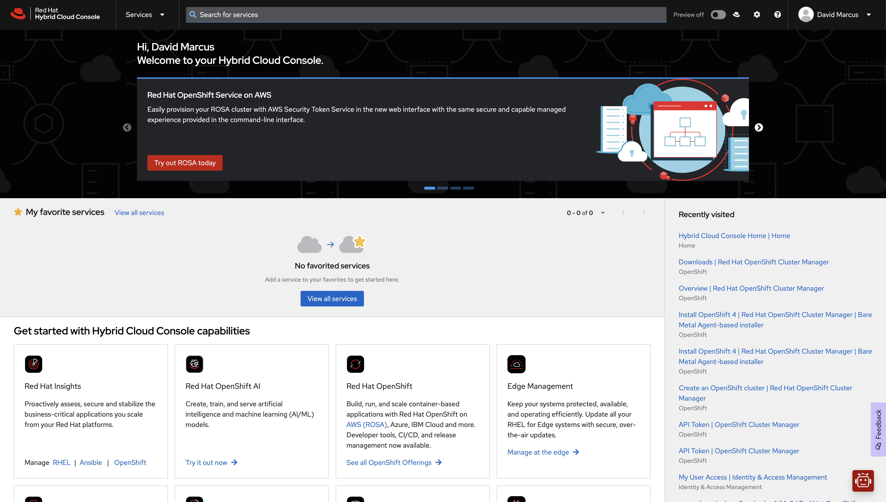
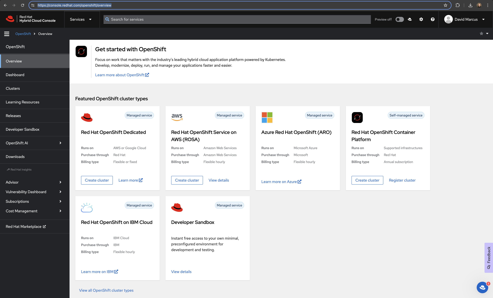
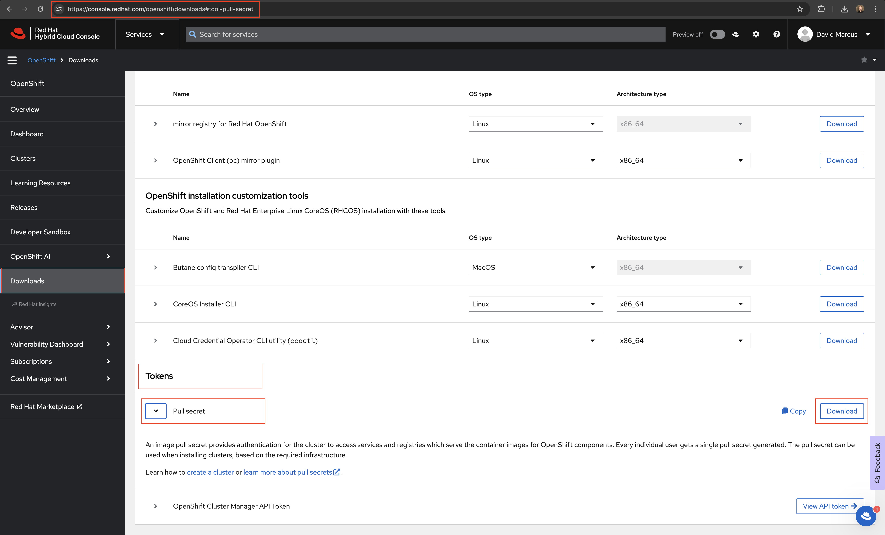

# Notes

# Updating Private Registry with Auth to pull release.txt

1. Go to console.redhat.com

1. Search 'openshift' or go directly to `https://console.redhat.com/openshift/overview`

1. Go to downloads or 'https://console.redhat.com/openshift/downloads#tool-pull-secret'

1. View the pull-secret.txt file
`cat <your-path>/pull-secret.txt
1. Find the entry for `"quay.io":{"auth":`
1. Copy the text in the quotations
`"quay.io":{"auth":"<copy-this-token>"` 
```
printf '<copied-token>' | base64 -d
```
1. Paste the output in your private registry auth location

## List of Container Images

You can find [release.txt](https://mirror.openshift.com/pub/openshift-v4/clients/ocp/stable-4.13/release.txt) to contain a list of images required to deploy the OpenShift Platform.

The tool [oc-mirror](https://github.com/openshift/oc-mirror) is extremely useful for helping life cycle the OpenShift platform along with various operators and software that runs on the platform.

The following information is produced by using the `oc-mirror` plugin.

Operational Examples

- [All for Disconnected](images/imageset-config-all-images.txt) - [[ImageSet Config](../components/imageset/imageset-config-all.yaml)]
- [OpensShift Upgrade - 4.13 to 4.14 (Platform Only)](images/imageset-config-ocp-upgrade-images.txt) - [[ImageSet Config](../components/imageset/imageset-config-ocp-upgrade.yaml)]

Grouped Components

- [OpenShift - Platform](images/imageset-config-ocp-images.txt) - [[ImageSet Config](../components/imageset/imageset-config-ocp.yaml)]
- [Operators - Red Hat Supported](images/imageset-config-redhat-images.txt) - [[ImageSet Config](../components/imageset/imageset-config-redhat.yaml)]
- [Operators - Red Hat Certified Partners / Nvidia](images/imageset-config-certified-images.txt) - [[ImageSet Config](../components/imageset/imageset-config-certified.yaml)]
- [Run.ai - Platform](images/imageset-config-runai-images.txt) - [[ImageSet Config](../components/imageset/imageset-config-runai.yaml)]

Regenerate the lists above into `scratch/mirror_media` using the following command:

```sh
./scripts/wip/image_list.sh
cp scratch/mirror_media/*images.txt docs/images/
```

## ACM Links

- https://role.rhu.redhat.com/rol-rhu/app/courses/do480-2.4/pages/ch08s04
- https://github.com/open-cluster-management-io/policy-collection/blob/main/community/CM-Configuration-Management/policy-acs-operator-central.yaml
- https://github.com/open-cluster-management-io/policy-collection/tree/main/community/CM-Configuration-Management

## Security Related Links

- https://docs.openshift.com/container-platform/4.14/security/index.html
- https://docs.openshift.com/container-platform/4.14/security/compliance_operator/co-overview.html

## Misc

```sh
pull_secret: '{"auths":{"none":{"auth":""}}}'
```
