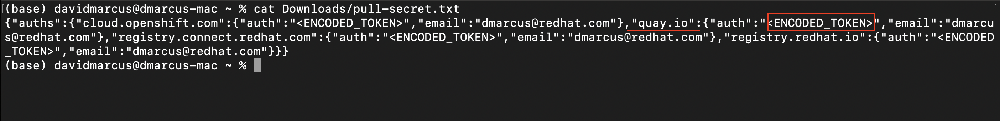
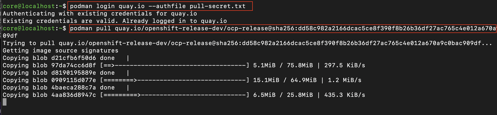

# Notes

## Updating your Private Registry (i.e. JFrog Artifactory) with credentials to pull OpenShift images

When using a private registry for installation or upgrading, you need to be able to authenticate to multiple Red Hat locations: cloud.openshift.com, quay.io, registry.connect.redhat.com and registry.redhat.io. The Red Hat OpenShift pull-secret.txt file provides these credentials. Below are the steps to fetch these credentials.

Prerequisites:
- you MUST have account to access `console.redhat.com`
- you MUST have access to your private registry
- you NEED `jq`, `base64`, `bash` to run the Shell example, but not required

### Steps

1. Go to console.redhat.com

1. Search 'openshift' or go directly to https://console.redhat.com/openshift/overview

1. Go to downloads or <https://console.redhat.com/openshift/downloads#tool-pull-secret>

1. View the pull-secret.txt file
`cat <your-path>/pull-secret.txt`
1. Find the entry for `"quay.io":{"auth":`

1. Copy the text in the quotations
`"quay.io":{"auth":"<COPY_THIS_COPY>"`
1. Base64 decode `echo "${TOKEN}" | base64 -d | tr ':' '\n'`
1. Paste the output in your private registry auth location

### Shell Example

```sh
TOKEN=$(cat scratch/pull-secret.txt | jq '.auths."quay.io".auth' | sed 's/"//g')
echo "${TOKEN}" | base64 -d | tr ':' '\n'
```

### Alternate
If you have `podman`, you can authenticate with the pull-secret.txt from your CLI using `podman login quay.io --authfile pull-secret.txt`



## List of Container Images

You can find [release.txt](https://mirror.openshift.com/pub/openshift-v4/clients/ocp/stable-4.13/release.txt) [[local copy]](images/release.txt) to contain a list of images required to deploy the OpenShift Platform.

The tool [oc-mirror](https://github.com/openshift/oc-mirror) is extremely useful for helping life cycle the OpenShift platform along with various operators and software that runs on the platform.

The following information is produced by using the `oc-mirror` plugin.

Executed Example

- [Example of config and outputs from oc-mirror](../components/imageset/example/)

Operational Examples

- [All for Disconnected](images/imageset-config-all-images.txt) - [[ImageSet Config](../components/imageset/imageset-config-all.yaml)]
- [OpensShift Upgrade - 4.13 to 4.14 (Platform Only)](images/imageset-config-ocp-upgrade-images.txt) - [[ImageSet Config](../components/imageset/imageset-config-ocp-upgrade.yaml)]
- [OpensShift Nvidia Operator Only](images/imageset-config-nvidia-only-images.txt) - [[ImageSet Config](../components/imageset/imageset-config-nvidia-only.yaml)]

Grouped Components

- [OpenShift - Platform](images/imageset-config-ocp-images.txt) - [[ImageSet Config](../components/imageset/imageset-config-ocp.yaml)]
- [Operators - Red Hat Supported](images/imageset-config-redhat-images.txt) - [[ImageSet Config](../components/imageset/imageset-config-redhat.yaml)]
- [Operators - Red Hat Certified Partners / Nvidia](images/imageset-config-certified-images.txt) - [[ImageSet Config](../components/imageset/imageset-config-certified.yaml)]
- [Run.ai - Platform](images/imageset-config-runai-images.txt) - [[ImageSet Config](../components/imageset/imageset-config-runai.yaml)]

Regenerate the lists above into `scratch/mirror_media` using the following command:

```sh
./scripts/wip/image_list.sh
cp scratch/mirror_media/*images.txt docs/images/
```

## Container Image Tags vs Digests

```sh
ls -l *_file
-rw-r--r--. 1 cory cory 17416 May  1 19:09 bad_file
-rw-r--r--. 1 cory cory    32    May  1 19:08 good_file

sha256sum *_file
d3025cdb95051ad1b992c4fc27784268d30bb0d80e375f2a2826a4bde8b50940  bad_file
68ea0127797450d105250d5d1e87fa04761cad4379c1d60918a2c8cd798a8dbd  good_file

mv good_file nail_file
mv bad_file good_file

sha256sum *_file
d3025cdb95051ad1b992c4fc27784268d30bb0d80e375f2a2826a4bde8b50940  good_file
68ea0127797450d105250d5d1e87fa04761cad4379c1d60918a2c8cd798a8dbd  nail_file
```

Even though someone renamed `good_file` we can still verify that it is the `good_file` based on the hash. And we won't be tricked into thinking the `bad_file` is the `good_file`. This is the same for container images.

## ACM Links

- <https://role.rhu.redhat.com/rol-rhu/app/courses/do480-2.4/pages/ch08s04>
- <https://github.com/open-cluster-management-io/policy-collection/blob/main/community/CM-Configuration-Management/policy-acs-operator-central.yaml>
- <https://github.com/open-cluster-management-io/policy-collection/tree/main/community/CM-Configuration-Management>

## Security Related Links

- <https://docs.openshift.com/container-platform/4.14/security/index.html>
- <https://docs.openshift.com/container-platform/4.14/security/compliance_operator/co-overview.html>

## Misc

```sh
pull_secret: '{"auths":{"none":{"auth":""}}}'
```
